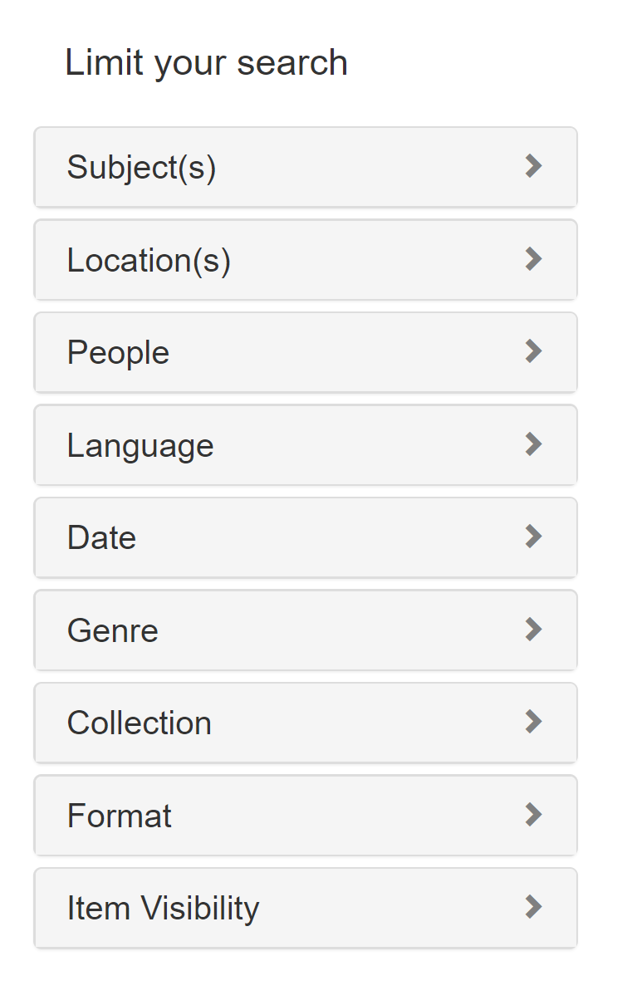

# Facet Fields

## Contents
1. [What Goes in my Facet Fields?](#what-information-goes-in-my-facet-fields)
2. [For Developers](#for-developers)

Facet fields are metadata fields that allow users to filter out certain results from a search. You can see facet fields if you click the search button and then look at the left sidebar. You'll see facet fields there under "Limit Your Search."

To see a list of all available facet fields, go to **Dashboard > Search (under Configuration) > Facets tab.** Here, you can also select which fields should display for your exhibit. You can also rearrange the order or sort them by frequency or value.

 
 

## What Information goes in my Facet Fields?
One general principle is that facet fields contain controlled vocabulary terms (such as [FAST](https://www.oclc.org/research/themes/data-science/fast.html)) while non-faceted fields contain keyword-searchable terms. Facet fields sometimes have the same or duplicate values of their non-faceted counterparts, but this may not always be the case for your specific metadata or objects.

In terms of [Solr](../glossary/README.md#solr) indexing or your [mapping document](../mapping_document), faceted fields end with *\_ftesim* or *\_ftesi* (their non-faceted counterparts would be *\_tesim* and *\_tesi*).

## For Developers
Facet fields must be configured in `app/controllers/catalog_controller`. See the [Blacklight configuration page](https://github.com/projectblacklight/blacklight/wiki/Configuration---Facet-Fields) for more info.

<< Previous: [How Spotlight Indexes Metadata](../how_solr_indexes_metadata)  |
[Table of Contents](../README.md#table-of-contents)  |
Next: [The Coordinates Field and Google Maps Block](../coordinates_field) >>
