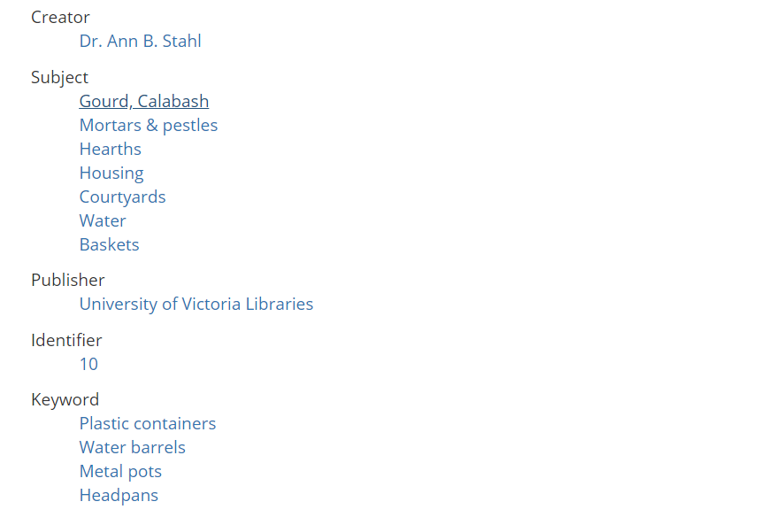
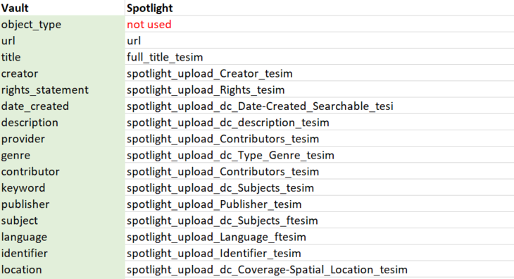
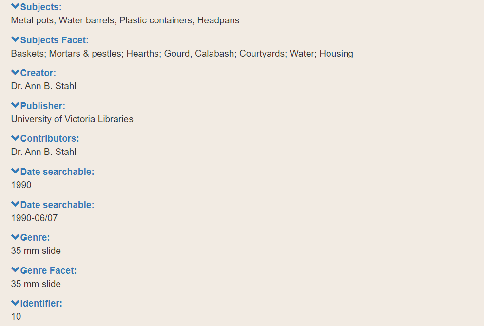
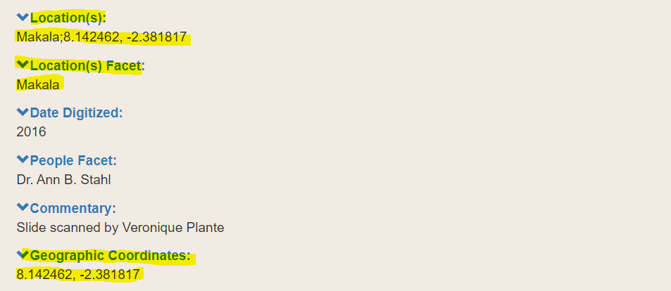

# Mapping Document

## Section Headings
1. [Examples](#examples)
2. [Special Considerations](#special-considerations)
  1.  [The url Field](#the-url-field)
  2. [Unused Fields](#unused-fields)
  3. [Facet Fields](#facet-fields-ftesi-ftesim-suffix)
  4. [Location Fields](#location-fields)
  5. [Unused Fields](#unused-fields)

A mapping or crosswalk document is a spreadsheet that lists each metadata field in Vault and its corresponding field in Spotlight. At minimum, it has 3 columns: one for Vault fields (a human-readable label); one for Spotlight fields (the name of the field indexed by Spotlight's backend); and one for general notes.

The purpose of a mapping document is to explicitly define which field in Vault should match a field in Spotlight, since this relationship is not immediately obvious to the computer or your friendly neighbourhood Spotlight developer. As the subject-matter expert in your collection's materials, *only you* (with some help) can map out this relationship so that no important information is lost. As a general rule, it's best to be as unambiguous as possible, even if that requires some extra notes.

To download a blank template, see [blank_mapping_doc_template.xslx](blank_mapping_doc_template.xslx) (Excel spreadsheet). This template includes links to relevant examples of each metadata field in Spotlight (you can leave this in if you wish or delete it).

To see an example of a completed template, see [Vault_to_SpotlightMapping.xslx](Vault_to_SpotlightMapping.xslx).

A mapping document is required in the [Pre-flight Checklist](../pre-flight_checklist/README.md).

## Examples

The following 3 screenshots demonstrate

  1. some example metadata in Vault
  2. the same metadata defined in a mapping document
  3. the finished product in Spotlight (after upload)

<a href="https://iaff.library.uvic.ca/concern/iaff_works/e5f0a67c-d547-4d54-8a1e-b7e942254f3d"><kbd></kbd></a>  

*Note the fields Creator, Subject, Publisher, Identifier, and Keyword*

<kbd></kbd>  

*In our mapping document, we map Creator to spotlight_upload_Creator_tesim, Subject to spotlight_upload_dc_Subjects_ftesim, etc.*

<a href="https://exhibits.library.uvic.ca/spotlight/iaff/catalog/17-16736"><kbd></kbd></a>  

*The final result after transforming the Vault metadata to Spotlight metadata*

## Special Considerations

### The url Field

This field comes pre-filled and you don't need to change it. It tells Spotlight which digital object matches which metadata (specifically, it provides a unique file path to the object).

### Facet Fields (-ftesi, -ftesim suffix)

Suffixes such as "ftesi" or "ftesim" indicate facet fields (e.g. ). Typically, they have the same contents as their non-faceted counterpart (e.g. ). See the [Metadata Concerns](../metadata_concerns/README.md#facet-fields) section for more information on how this is indexed in Spotlight and what the final result looks like.

### Annotation Fields

The annotation fields (Spotlight only) are any fields with "annotation" in the name (spotlight_annotation_x_dbsm,spotlight_annotation_y_dbsm, etc.). These are marked N/A and you don't need to change them. They are reserved in the Spotlight database to store the locations of optional annotations in the item viewer.

### Unused Fields

Sometimes a field in Vault has no corollary in Spotlight, or a field is not important enough to your data set for you to fill it in. If that's the case, simply write "not used" or something to that effect (as opposed to leaving it blank, which could mean you didn't see it). This field will be ignored in the upload process. You can always edit metadata after it's been uploaded.

### Location Fields

There are 3 fields that we use to mark spatial location: spotlight_upload_dc_Coverage-Spatial_Location_ftesim, spotlight_upload_Coverage-Temporal_tesim, and spotlight_upload_dc_box_tesim. Depending on your collection, you can have any combination of used/unused fields.

A typical use case is as follows:  

| 1. spotlight_upload_dc_Coverage-Spatial_Location_tesim | 2. spotlight_dc_Coverage-Spatial_Location_ftesim | 3. spotlight_upload_dc_box_tesim |
| --------------------------------------------------- | --------------------------------------------- | ----------------------------- |
| A [controlled vocabulary term](../glossary/README.md) for a location and, optionally, geographic coordinates. | A duplicate of column 1. | The geographic coordinates of the location described in columns 1 & 2. |

You can see an example of this in the [African Futures exhibit](https://exhibits.library.uvic.ca/spotlight/iaff) if you go to an exhibit item page such as [this one](https://exhibits.library.uvic.ca/spotlight/iaff/catalog/17-16738) pictured below.

