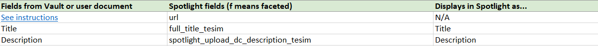
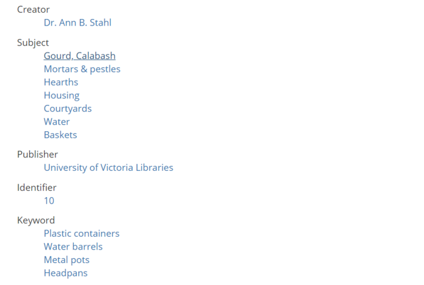
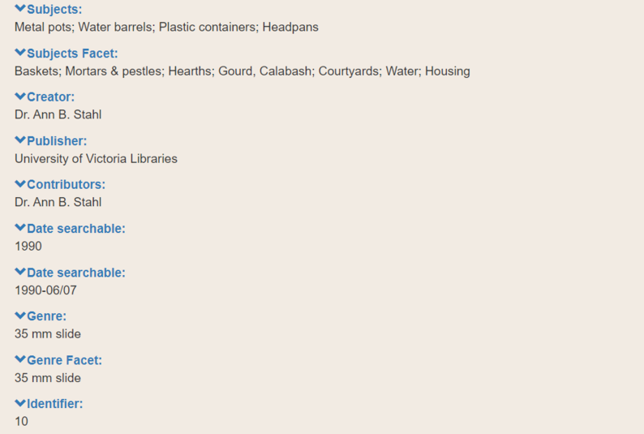
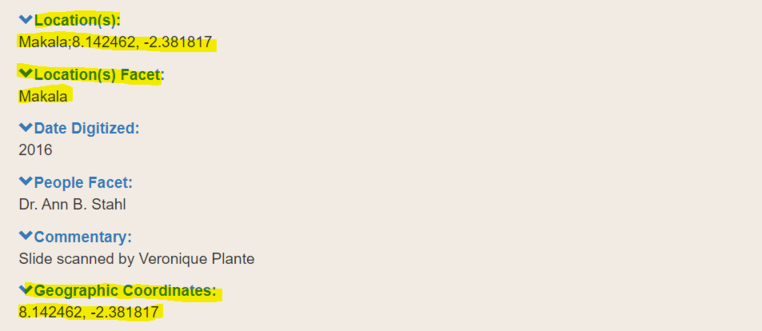

# Mapping Document

## Contents
1. [How to Use](#how-to-use)
2. [Examples](#examples)
3. [Special Considerations](#special-considerations)
   * [The url Field](#the-url-field)
   * [Unused Fields](#unused-fields)
   * [Facet Fields](#facet-fields-ftesi-ftesim-suffix)
   * [Location Fields](#location-fields)

A mapping or crosswalk document is a spreadsheet that lists each metadata field in Vault and its corresponding field in Spotlight. At minimum, it has 3 columns: one for Vault fields (the label); one for Spotlight fields (the name of the field indexed by Spotlight's backend); and one for general notes.

Spotlight stores and indexes data differently than Vault. The purpose of a mapping document is to explicitly define which field in Vault should match a field in Spotlight, since this relationship is not immediately obvious to a computer or, sometimes, to a Spotlight developer). As the subject-matter expert in your collection's materials, *only you* (with some help) can map out this relationship so that no important information is lost. As a general rule, it's best to be as unambiguous as possible.

To download a blank template, see [blank_mapping_doc_template.xslx](blank_mapping_doc_template.xslx) (Excel spreadsheet). This template includes links to relevant examples of each metadata field in Spotlight. This template lists *all possible* fields in Spotlight, some of which you won't need (see [unused fields](#unused-fields)).

A mapping document is required in the [Pre-flight Checklist](../pre-flight_checklist/README.md).

## How to Use

**Note:** If you're loading directly into Spotlight (i.e. not from Vault), replace "Vault" in the following instructions with "user document."

1. Download a template by clicking [here](https://github.com/UVicLibrary/VaultToSpotlight/blob/master/mapping_document/blank_mapping_doc_template.xlsx) (or on mapping_doc_template.xslx above) and then click "Download". Then open the file in Microsoft Excel.  

2. The template may look overwhelming at first but the overall concept is simple. The first two columns act like the legend of a map. In a map legend, there is a symbol on the left and a translation of it on the right. Both refer to the same entity.  

   A mapping document is similar: the left column is how Vault represents this metadata while the right column is how Spotlight represents the same data. For Vault, we use the human-readable label. For Spotlight, we use a "back-end" representation stored in [Solr](../glossary/README.md#solr). To read more about how Solr stores metadata, see [here](../user_document/README.md#how-solr-indexes-metadata).

<kbd></kbd>  

<kbd></kbd>  

*When a developer exports data from Vault, they run a piece of code (called a script) that transforms data labelled in Vault as column 1 (e.g. Title) into data labelled in Spotlight as column 2 (e.g. full_title_tesim).*

3. Make a list of all fields in your metadata in Vault and then match each one to the corresponding field in Spotlight, using column 3 ("Displays in Spotlight as...") as a guide for what you want the final product to be. If you're unsure if something matches, refer to the examples in column 4 ("Example of Spotlight field") to see how a term's been used in previous exhibits.  

   Some fields require special attention. See ["Special Considerations"](#special-considerations) for more and how to deal with [unused fields](#unused-fields). You can always edit metadata after it has been loaded into Spotlight.

## Examples

The following 3 screenshots demonstrate

  1. some example metadata in Vault
  2. the same metadata defined in a mapping document
  3. the finished product in Spotlight (after upload)

<a href="https://iaff.library.uvic.ca/concern/iaff_works/e5f0a67c-d547-4d54-8a1e-b7e942254f3d"><kbd></kbd></a>  

*Note the fields Creator, Subject, Publisher, Identifier, and Keyword*

<kbd></kbd>  

*In our mapping document, we map Creator to spotlight_upload_Creator_tesim, Subject to spotlight_upload_dc_Subjects_ftesim, etc.*

<a href="https://exhibits.library.uvic.ca/spotlight/iaff/catalog/17-16736"><kbd></kbd></a>  

*The final result after transforming the Vault metadata to Spotlight metadata*

## Special Considerations

### The url Field

This field comes pre-filled and you don't need to change it. It tells Spotlight which digital object matches which metadata (specifically, it provides a unique file path to the object).

### Facet Fields (-ftesi, -ftesim suffix)

Suffixes such as "ftesi" or "ftesim" indicate facet fields (e.g. spotlight_upload_dc_Date-Created_Searchable_ftesi, spotlight_upload_dc_Type_Genre_ftesim). See the [User Document](../user_document/README.md#facet-fields) section for more information on how this is indexed in Spotlight and what the final result looks like.

### Unused Fields

There will most likely be some fields in Spotlight that you don't need or want to use or Vault fields that don't map to anything in Spotlight. In that case, omit it (i.e. leave the cell blank under "Fields from Vault or user document") or write "N/A".

Because of this, please make sure *every field in Vault that you want to appear in Spotlight is included*. Fields not listed won't transfer.

### Location Fields

There are 3 fields that we use to describe spatial location: spotlight_upload_dc_Coverage-Spatial_Location_ftesim, spotlight_upload_Coverage-Temporal_tesim, and spotlight_upload_dc_box_tesim. Depending on your collection, you can have any combination of used/unused fields.

A typical use case is as follows:  

| 1. spotlight_upload_dc_Coverage-Spatial_Location_tesim | 2. spotlight_dc_Coverage-Spatial_Location_ftesim | 3. spotlight_upload_dc_box_tesim |
| --------------------------------------------------- | --------------------------------------------- | ----------------------------- |
| A [controlled vocabulary term](../glossary/README.md) for a location and, optionally, geographic coordinates. | A duplicate of column 1 without any coordinates. | Only the geographic coordinates of the location described in columns 1. |

You can see an example of this in the [African Futures exhibit](https://exhibits.library.uvic.ca/spotlight/iaff) if you go to an exhibit item page such as [this one](https://exhibits.library.uvic.ca/spotlight/iaff/catalog/17-16738) pictured below.

<< Previous: [The Coordinates Field and Google Maps Block](../coordinates_field)  |
[Table of Contents](../README.md#table-of-contents)  |
Next: [Visibility Settings](../visibility_settings) >>
