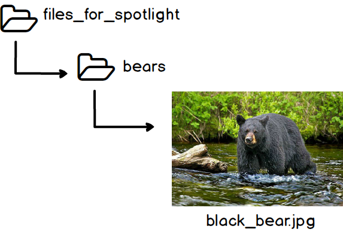

# The URL column

For uploading items directly into Spotlight, the url column contains a **unique** file name or file path to a file on the [Q: drive](../glossary#q:-drive). For importing items from Vault, the url column contains the path to the [IIIF manifest](../glossary#iiif-manifest) for each item, or the link/url to a specific item page). Once items are uploaded, file names do not show up on Spotlight.

You can name your files anything you want, with two caveats:
  1. No two files in the same folder can have the same name.
  2. The file name cannot have any spaces or commas. You can replace these with underscores or hyphens.

Ideally, if files are in nested folders on Q: Drive, the url column will also contain the name of the subfolder(s), connected to the file name with forward slashes (/). For example, the file pictured below would be named "bears/black_bear.jpg."

<< Previous: [User Document](../user_document)  |
[Table of Contents](../README.md#table-of-contents)  |
Next: [The Coordinates Field and Google Maps Block](../coordinates_field) >>
