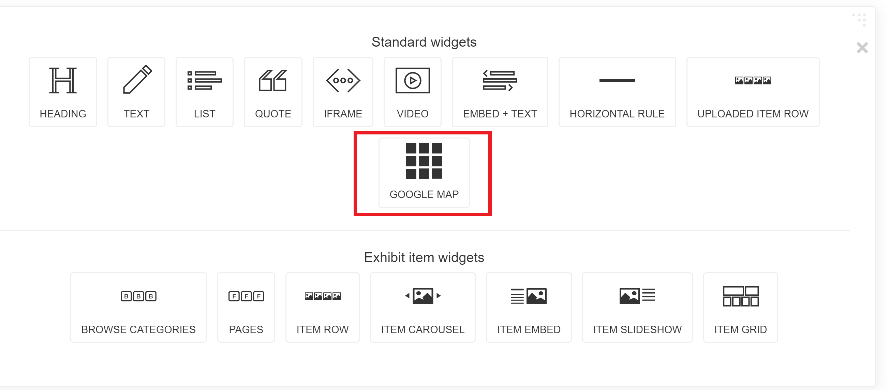

# The Coordinates Field and Google Map Block

The Location(s) field (spotlight_upload_dc_Coverage-Spatial_Location_tesim) contains a place name (using [controlled vocabulary](../glossary/README.md#controlled-vocabulary)) and, optionally, a semicolon and coordinates for a location in decimal degrees format. An example is "British Columbia--Vancouver;49.263456,-123.250567".

Here is a [conversion tool](https://www.pgc.umn.edu/apps/convert/) for different coordinate formats.

What's the relationship between the Location(s) Facet field and the non-faceted Location(s) field? The faceted field contains only the controlled vocabulary terms in the non-faceted Location(s) field since we don't need to filter search results by coordinates. [Read more](facet_fields.md) about facet fields.

## Google Map Block

The Google Map Block allows users to browse an exhibit's items by location. It also clusters multiple items that have the same location. A user hovers over a point on the map and a speech bubble pops up with the relevant title, description, and thumbnail. Users can click on the thumbnail or title to be taken to that item's page.

For a live demo of what the maps block can do, see [the homepage](https://exhibits.library.uvic.ca/spotlight/ian-mctaggart-cowan) for the Ian McTaggert Cowan exhibit, or the ["Buildings" page](https://exhibits.library.uvic.ca/spotlight/mcm/feature/3-buildings) for the Mid-Century Architecture exhibit.

To add a Google Map block to a feature page, click the plus sign as you would to add any other block. Select the Google Map block. Type in search terms separated by commas and click the Save button. Solr will automatically populate the map with items based on your search terms.

<kbd></kbd>

## For Developers

#### Related Files
* `app/sir_trevor_blocks/google_map_block.rb`
* `app/views/spotlight/sir_trevor/blocks/_google_map_block.html.erb`

The Google Map block works by sending a request to Solr for each search term and then grabbing the title, description, thumbnail link, and location from each document in the Solr response. It then does a regex search for valid coordinates in the location field and uses it to plot a point on the map. Then it generates the HTML needed for the speech bubbles that appear when a user hovers over a point.

For more on the Google Maps API, see Google's [tutorial page](https://developers.google.com/maps/documentation/javascript/tutorial).

<< Previous: [Facet Fields](facet_fields.md)  |
[Table of Contents](../README.md#table-of-contents)  |
Next: [Mapping Document](../mapping_document) >>
